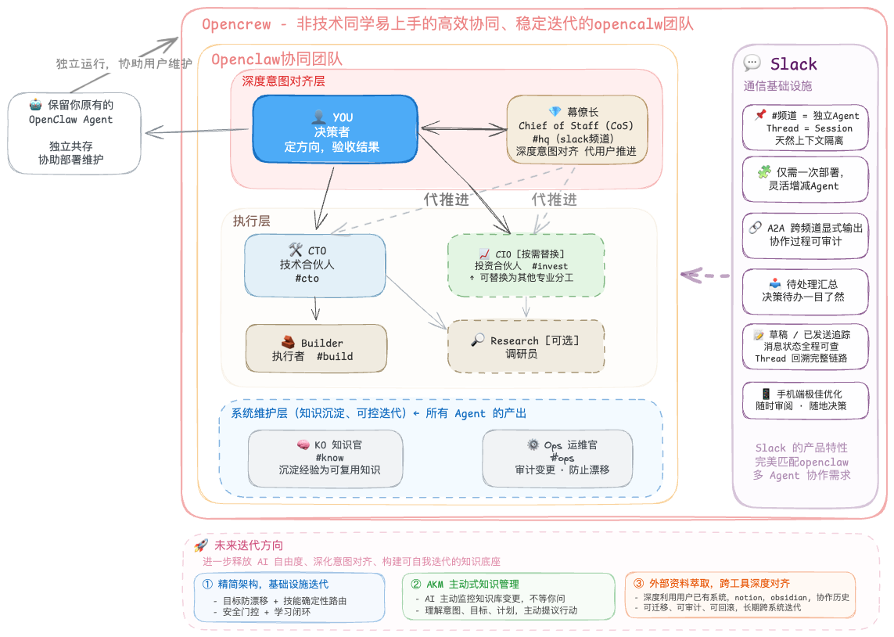

[中文](README.md) | **English**

# OpenCrew

> A multi-agent operating system for decision-makers.
> Turn your OpenClaw into a manageable AI team — domain experts each own their lane, experience auto-distills, and Slack is your command center.

[](LICENSE)
[](https://github.com/openclaw/openclaw)
[](docs/CONTRIBUTING.md)

---

## Table of Contents

- [What Problem Does This Solve](#what-problem-does-this-solve)
- [Architecture at a Glance](#architecture-at-a-glance)
- [Get Started in 10 Minutes](#get-started-in-10-minutes)
- [Core Concepts at a Glance](#core-concepts-at-a-glance)
- [Documentation Guide](#documentation-guide)
- [Stable vs Experimental](#stable-vs-experimental)
- [FAQ](#faq)
- [Contributing](#contributing)
- [The Journey](#the-journey)

---

## What Problem Does This Solve

If you're using OpenClaw, you've probably hit these walls:

| Your Pain Point | Root Cause | How OpenCrew Fixes It |
|----------------|------------|----------------------|
| Your agent gets "dumber" the longer you chat | One agent handles every domain — context bloat | Multiple agents each own their domain, no cross-contamination |
| Juggling multiple projects, constantly switching sessions | No visual task overview | Slack channel = role, thread = task — everything at a glance |
| Every step needs your confirmation — exhausting | Agent doesn't know what it can do on its own | Autonomy Ladder: reversible actions proceed automatically, irreversible ones ask you |
| You hit the same pitfalls again and again | Lessons are scattered across chat history | Three-layer Knowledge Distillation: conversations → structured summaries → reusable knowledge |
| Your agent drifts further off-track over time | Self-adjustments with no audit trail | Dedicated Ops agent handles auditing and drift prevention |

**In one sentence**: The problem isn't that OpenClaw isn't powerful enough — it's that one agent isn't enough. You need a team.

---

## Architecture at a Glance

> Core mental model: **Channel = Role, Thread = Task**



OpenCrew has three layers, each with clear responsibilities:

**Layer 1: Intent Alignment** — You + CoS (Chief of Staff)

You're the decision-maker. You set direction and sign off on results. CoS is your strategic partner — aligning on your deeper goals and pushing things forward when you're away. CoS is not a gateway; you can jump into any channel and talk to anyone directly.

**Layer 2: Execution** — CTO / Builder / CIO / Research

CTO breaks down work and owns architecture. Builder implements. CIO is the domain expert (defaults to investment, but swap in legal, marketing, or any domain you need). Research investigates on demand.

**Layer 3: System Maintenance** — KO + Ops

KO (Knowledge Officer) distills reusable knowledge from all outputs. Ops (Operations Officer) audits system changes and prevents drift. These two don't do business work — they keep the system healthy.

> Minimum viable setup: CoS + CTO + Builder (3 agents to get running). Add KO / Ops / CIO / Research as needed.

---

## Get Started in 10 Minutes

> Prerequisites: You can already use OpenClaw normally (`openclaw status` works), and Slack is connected.
> If Slack isn't connected yet → [Slack Setup Guide](docs/en/SLACK_SETUP.md) (~20 minutes)

### Step 1: Create Slack Channels

Create 3 channels in your Slack workspace (minimum setup):

```
#hq     — CoS (Chief of Staff)
#cto    — CTO (Technical Co-founder)
#build  — Builder (Executor)
```

Then invite the bot to each channel: type `/invite @your-bot-name` in each one.

### Step 2: Deploy Files

Copy this repo's files into your OpenClaw:

```bash
# Copy global protocols
cp -r shared/* ~/.openclaw/shared/

# Copy each agent's workspace
for a in cos cto builder; do
  mkdir -p ~/.openclaw/workspace-$a/memory
  cp -r workspaces/$a/* ~/.openclaw/workspace-$a/
  # Let every agent access the global protocols
  ln -sf ~/.openclaw/shared ~/.openclaw/workspace-$a/shared
done
```

> Don't want to type commands? Send the deployment instructions from [DEPLOY.en.md](DEPLOY.en.md) to your existing OpenClaw and let it do the work.

### Step 3: Write Config and Restart

Merge the minimal config snippet from [CONFIG_SNIPPET](docs/en/CONFIG_SNIPPET_2026.2.9.md) into `~/.openclaw/openclaw.json`, then:

```bash
openclaw gateway restart
```

### Verify

Send a message in `#hq` → CoS replies ✅
Ask CTO in `#cto` to dispatch a task to Builder → a thread appears in `#build`, Builder replies ✅

> Detailed step-by-step guide (including token setup, common errors, verification checklist) → [Full Getting Started Guide](docs/en/GETTING_STARTED.md)

---

## Core Concepts at a Glance

OpenCrew runs on a few key mechanisms. Here's the 30-second overview — full details at → [Core Concepts Deep Dive](docs/en/CONCEPTS.md)

**Autonomy Ladder** — When should an agent act on its own vs. ask you?

| Level | Meaning | Examples |
|-------|---------|----------|
| L0 | Suggest only, no action | — |
| L1 | Reversible actions, just do it | Write drafts, research, organize docs |
| L2 | Has impact but rollback-able, report after | Open PRs, change configs, write analyses |
| L3 | Irreversible, must get your confirmation | Deploy, trade, delete, send externally |

**Task Classification (QAPS)** — Different task types, different handling rules

| Type | Meaning | Needs Closeout? |
|------|---------|----------------|
| Q | One-off question | No |
| A | Small task with a deliverable | Yes |
| P | Project (multi-step, multi-day) | Yes + Checkpoint |
| S | System change | Yes + Ops audit |

**A2A Two-Step Trigger** — How agents collaborate

Since all agents share one Slack bot, the bot's own messages don't trigger itself. So cross-agent collaboration takes two steps: first post a visible message in the target channel (anchor), then use `sessions_send` to actually trigger the other agent. Details at → [A2A Protocol](shared/A2A_PROTOCOL.md)

**Three-Layer Knowledge Distillation** — How chat history becomes organizational assets

```
Layer 0: Raw conversations (for audit, not directly reused)
Layer 1: Closeouts (10–15 line structured summaries, ~25x compression)
Layer 2: KO-distilled abstract knowledge (principles / patterns / lessons learned)
```

---

## Documentation Guide

### For You (the User)

| Document | What's Inside | When to Read |
|----------|--------------|--------------|
| **[Full Getting Started Guide](docs/en/GETTING_STARTED.md)** | Zero-to-running detailed steps + common issues | First-time deployment |
| **[Core Concepts Deep Dive](docs/en/CONCEPTS.md)** | Complete explanation of Autonomy Ladder, QAPS, A2A, Knowledge Distillation | Want to deeply understand the system |
| **[Architecture Design](docs/en/ARCHITECTURE.md)** | Three-layer architecture, design trade-offs, rationale | Want to understand design decisions |
| **[Customization Guide](docs/en/CUSTOMIZATION.md)** | Add/remove/modify agents, swap domain experts | Want to adjust your team setup |
| **[Known Issues](docs/en/KNOWN_ISSUES.md)** | Real system boundaries and current best practices | When you hit weird behavior |
| **[The Journey](docs/en/JOURNEY.md)** | From one person's pain point to a virtual team | Want the backstory |
| **[FAQ](docs/en/FAQ.md)** | Frequently asked questions | Quick lookup |

### For Your Agents (what agents need to understand during deployment)

| Document | What's Inside | Who Reads It |
|----------|--------------|-------------|
| **[Agent Onboarding Guide](docs/en/AGENT_ONBOARDING.md)** | What an agent should read on first boot, how to understand the system | Newly deployed agents |
| Everything under **shared/** | Global protocols and templates (the agent "employee handbook") | All agents |
| SOUL.md / AGENTS.md in each workspace | Role definitions and workflows | The respective agent |

---

## Stable vs Experimental

### ✅ Stable and Running

- Multi-agent domain separation + Slack channel binding
- A2A two-step trigger (Slack visible anchor + sessions_send)
- Closeout / Checkpoint enforced structured outputs
- Autonomy Ladder (L0–L3)
- Ops Review governance loop
- Signal scoring + KO Knowledge Distillation

### 🔄 Experimental

- Better knowledge system (cross-session semantic retrieval)
- Lighter architecture (v2-lite: 7 agents → 5, 9 shared files → 3)
- More stable approach for Slack root message independent sessions

---

## FAQ

**Q: Do I need to know how to code?**

No. OpenCrew was designed and deployed by a non-technical user with an economics/MBA background. You need to be comfortable typing a few terminal commands — or just send the deployment commands to your existing OpenClaw and let it handle everything.

**Q: What's the minimum number of agents?**

3: CoS + CTO + Builder. That's the minimum viable setup. Scale up when you notice experience is being lost (add KO) or the system is drifting (add Ops).

**Q: How is this different from CrewAI / AutoGen?**

Those are SDKs for developers to write code. OpenCrew is a system for decision-makers to manage a team — you manage your AI team through Slack, no code required. They solve "how to orchestrate agents." OpenCrew solves "how to manage an AI team."

**Q: Can I use something other than Slack?**

Slack is the primary interface for now. The architecture is built around "channel = role, thread = task," and Slack's features (thread isolation, Unreads, mobile app) are a natural fit. Other platforms are on the roadmap.

**Q: Won't this burn through a lot of tokens?**

More than a single agent, yes — each agent has its own context. But the Closeout mechanism (~25x compression) and domain isolation (each agent only sees its own domain's information) actually make per-conversation token usage more efficient. Total volume goes up, but each agent runs leaner.

**Q: Does Slack Free plan work?**

Yes. The Slack APIs OpenCrew uses (Socket Mode) are fully available on the free plan. The only limitation is 90-day message history retention, but important information is already distilled through Closeouts and the knowledge base.

More Q&A → [FAQ](docs/en/FAQ.md)

---

## Contributing

Issues and PRs are welcome. We especially appreciate:

- Improvement ideas for multi-agent collaboration architecture
- Practical experience with knowledge systems (retrieval / indexing / memory)
- Stability optimizations for Slack thread / session handling
- Adapters for non-Slack platforms (Discord / Telegram / Lark)
- Bug reports and improvements for our English documentation

---

## The Journey

This project was built solo by a non-technical OpenClaw user with an economics/MBA background.

It started with discovering that "one agent handling every domain leads to context bloat," evolved into a 7-agent collaboration architecture, and then came a series of technical challenges — A2A loop storms, deliveryContext drift, and more. The full record of pitfalls and design decisions is at → [The Journey](docs/en/JOURNEY.md)

**Why open-source now?** The system has been running in real use and iterating steadily, but some edge cases remain unsolved. Rather than wait for "perfect," we're putting the working framework out there — so more people can give feedback, co-build, and evolve it together.

---

## Directory Structure

```
opencrew/
├── README.md                         ← Chinese README
├── README.en.md                      ← You are here
├── DEPLOY.md                         ← Deployment guide (Chinese)
├── DEPLOY.en.md                      ← Deployment guide (English)
├── LICENSE                           ← MIT
├── shared/                           ← Global protocols and templates (shared by all agents)
├── workspaces/                       ← Each agent's workspace
├── docs/
│   ├── en/                           ← English documentation
│   ├── GETTING_STARTED.md            ← Full getting started guide (Chinese)
│   ├── CONCEPTS.md                   ← Core concepts deep dive (Chinese)
│   ├── ARCHITECTURE.md               ← Architecture design (Chinese)
│   ├── CUSTOMIZATION.md              ← Customization guide (Chinese)
│   ├── AGENT_ONBOARDING.md           ← Agent onboarding guide (Chinese)
│   ├── FAQ.md                        ← FAQ (Chinese)
│   ├── KNOWN_ISSUES.md               ← Known issues (Chinese)
│   ├── JOURNEY.md                    ← The journey (Chinese)
│   ├── SLACK_SETUP.md                ← Slack app creation guide (Chinese)
│   └── CONFIG_SNIPPET_2026.2.9.md    ← Minimal config snippet (Chinese)
├── patches/                          ← Advanced workarounds (not recommended for beginners)
└── v2-lite/                          ← Lighter architecture exploration (experimental)
```

---

## License

MIT
